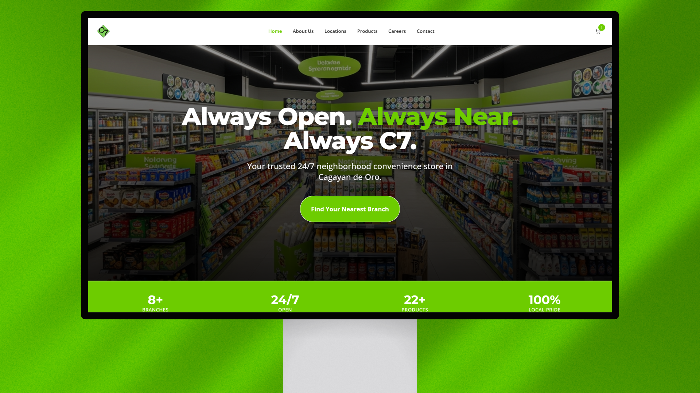
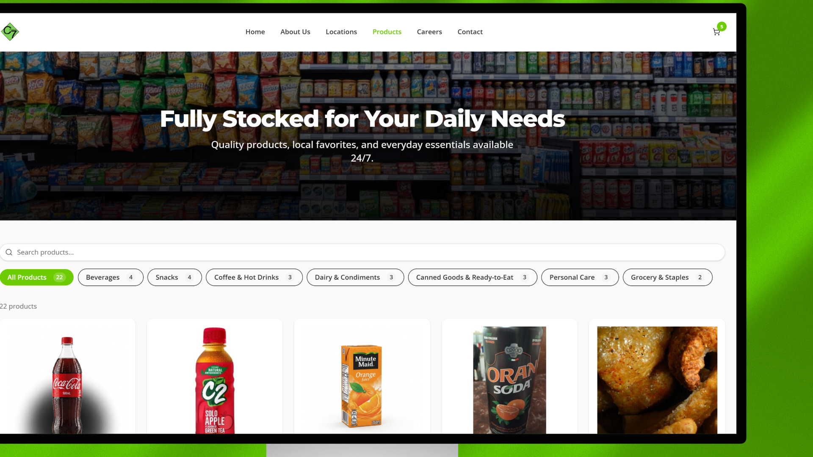
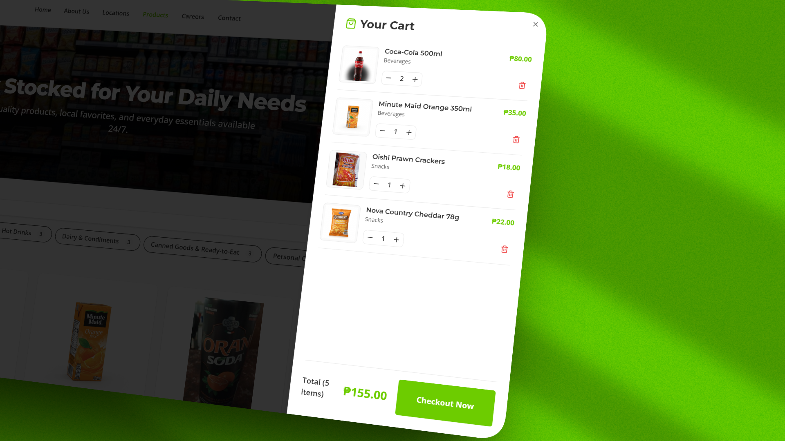

# C7 Convenience Store — Web Platform

> A full-stack web application for a 24/7 neighborhood convenience store chain in Cagayan de Oro, Philippines.



---

## Overview

C7 is a modern, production-ready storefront built to digitize a local convenience store chain — enabling customers to browse products, locate branches, explore careers, and submit inquiries, all from one seamless web experience.

This project demonstrates end-to-end full-stack development: from API design and database modeling to UI/UX implementation and deployment architecture.

---

## Screenshots

| Products Catalog | Shopping Cart |
|---|---|
|  |  |

---

## Features

- **Product Catalog** — Browse 22+ products across 7 categories with live search and category filtering
- **Shopping Cart** — Persistent cart with quantity controls and checkout flow
- **Branch Locator** — Interactive map (OpenStreetMap/Leaflet) with 8+ branch pins and Google Maps directions
- **Careers Portal** — Live job listings with requirements and in-app application via contact form
- **Contact System** — Form-based inquiries with backend persistence
- **Auto-seeding** — Database self-seeds with store data on first run

---

## Tech Stack

| Layer | Technology |
|---|---|
| Frontend | React 19, TypeScript, Tailwind CSS v4, Shadcn UI |
| Routing | Wouter |
| Data Fetching | TanStack Query |
| Forms & Validation | React Hook Form + Zod |
| Maps | Leaflet / React Leaflet |
| Backend | Node.js, Express v5, TypeScript |
| Database | MongoDB Atlas |
| API Design | OpenAPI spec → auto-generated client via Orval |
| Build | Vite, pnpm monorepo |
| Deployment | Vercel (serverless) |

---

## Architecture

```
monorepo (pnpm workspaces)
├── artifacts/c7-store        # React frontend
├── artifacts/api-server      # Express REST API
├── lib/api-spec              # OpenAPI source of truth
├── lib/api-client-react      # Auto-generated React hooks (Orval)
├── lib/api-zod               # Shared Zod schemas
└── lib/db                    # Database layer
```

The frontend consumes a type-safe API client generated directly from the OpenAPI spec — keeping the frontend and backend in sync with zero manual interface maintenance.

---

## Highlights

- **Code-generated API client** — Orval generates typed React Query hooks from the OpenAPI spec, eliminating manual fetch boilerplate and drift between client and server contracts
- **Shared validation** — Zod schemas are shared across the frontend and backend, ensuring consistent data rules in a single source
- **Monorepo structure** — Clean separation of concerns across packages with shared libraries and coordinated builds via pnpm workspaces
- **Self-seeding database** — On first boot, the API automatically seeds MongoDB with categories, products, and branch locations — zero manual setup required

---

## Local Development

```bash
# Install dependencies
pnpm install

# Start API server
pnpm --filter api-server dev

# Start frontend
pnpm --filter c7-store dev
```

---

## About

Built as a portfolio project to demonstrate full-stack product development — from database to deployment — for a real-world local business use case.

**Stack focus:** TypeScript · REST API design · MongoDB · React · Monorepo architecture · Vercel deployment
